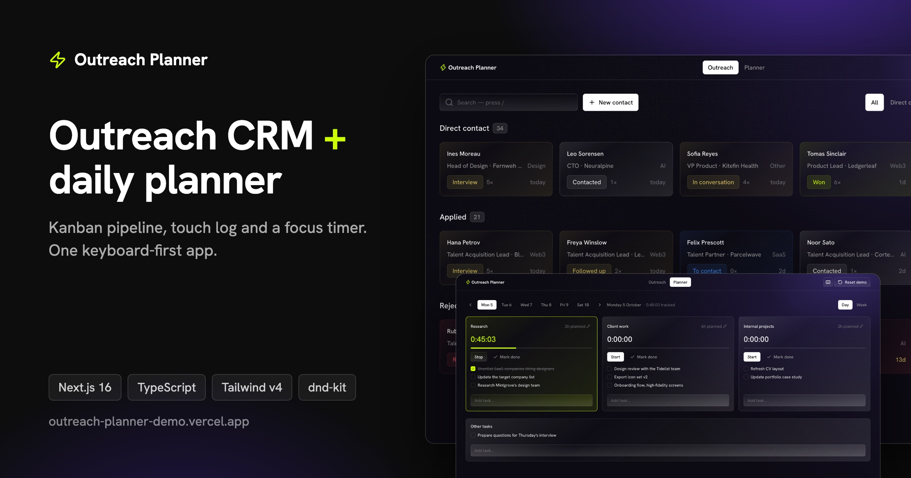
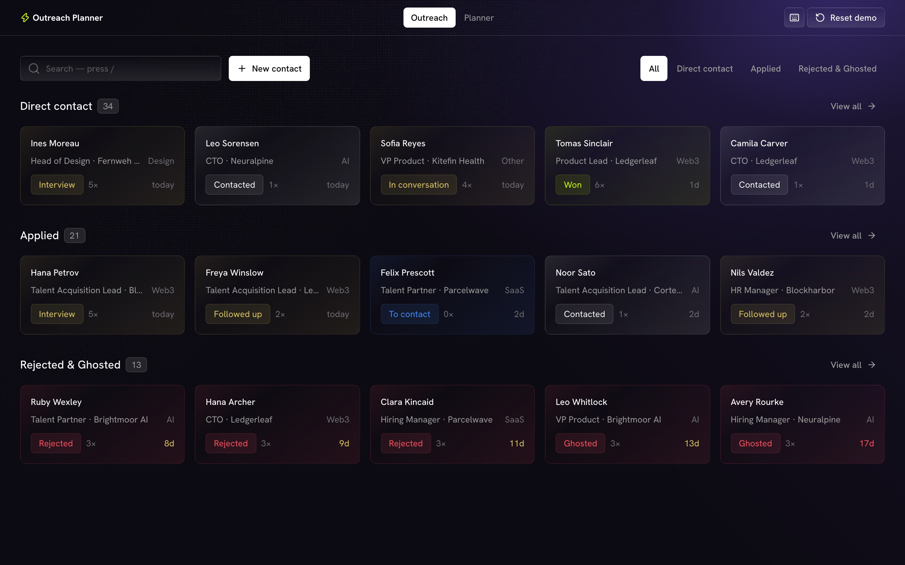
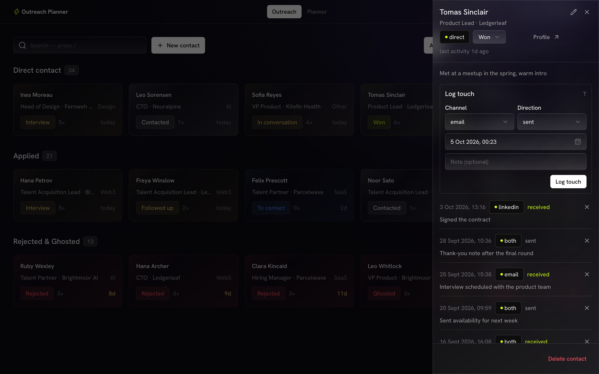
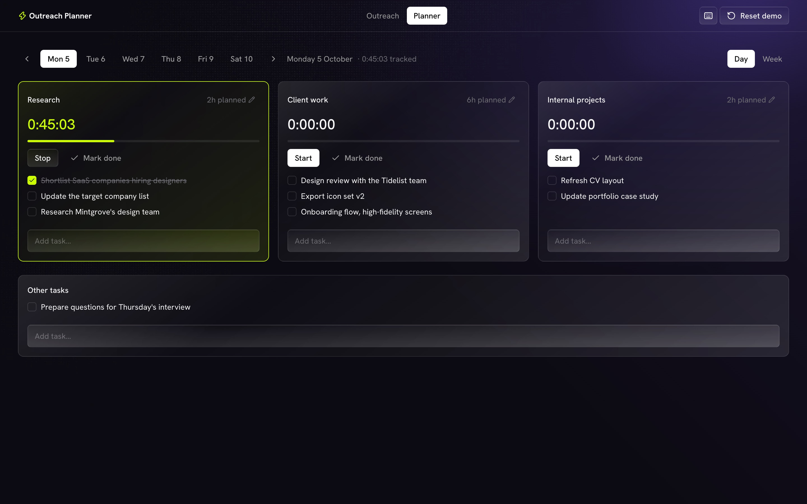
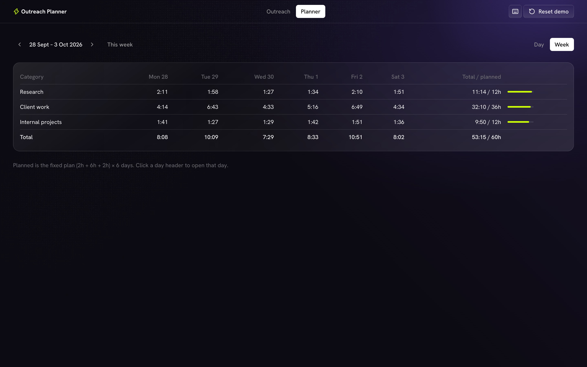
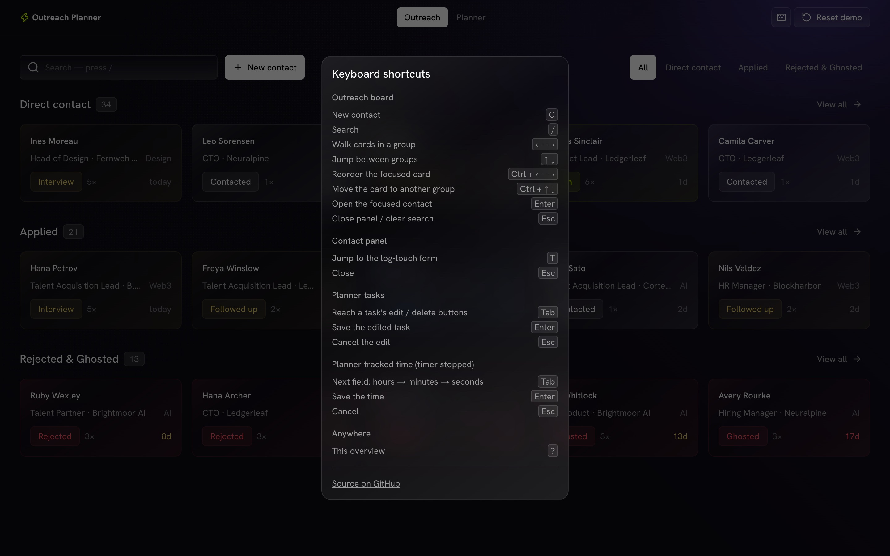
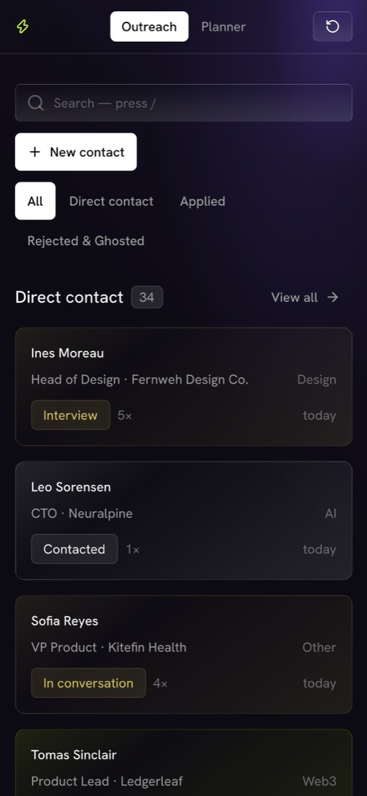

# Outreach Planner

**An outreach CRM and a daily time-blocking planner in one dark,
keyboard-first app.**

**[Live demo →](https://outreach-planner-demo.vercel.app)** · No sign-up.
It runs in your browser with fictional sample data.



I built it as a daily tool for one job: reaching out to people, and keeping
track of who replied, who went quiet and where my hours went. This repo is
the public demo edition. Every person, company and note in it is made up.

---

## What it does

### Outreach board



- **A nine-stage pipeline:** To contact → Contacted → Followed up →
  Replied → In conversation → Interview → Won / Rejected / Ghosted.
- **Three groups:** Direct contact, Applied, and Rejected & Ghosted. The
  home view previews each group, and "View all" opens the full group with
  niche filters and pagination.
- **Drag and drop** within and between groups, with mouse or touch.
- **Activity at a glance:** every card shows its touch count and days since
  the last activity. The day count turns yellow at 7+ days and red at 14+.
- **Ranked search** (`/`): first names match first, then last names, then
  companies and roles.

### Contact panel



- The full touch timeline (channel, direction, note), newest first.
- Log a touch in seconds (`T` jumps to the form). Logging one on a *To
  contact* person moves them to *Contacted* automatically.
- Edit, change status, or delete. A company note also counts as activity.

### Daily planner



- Three blocks per day, Monday to Saturday: research (2h), client work
  (6h) and internal projects (2h).
- **A start/stop timer per block.** Only one runs at a time, so starting
  one banks the time of the other.
- Edit planned hours per day, and correct tracked time by hand while the
  timer is stopped.
- Tasks per block plus loose day tasks: add, check off, rename, delete.

### Week view



Actual vs planned time per category, per day and in total.

### Keyboard-first and responsive

| | |
| --- | --- |
|  |  |

`C` adds a new contact, `/` searches, arrow keys move between cards,
`Ctrl + arrows` moves a card, `Enter` opens a contact, `?` lists every
shortcut. On a phone, columns stack and drag-and-drop works by touch.

---

## How it's built

- **Optimistic UI everywhere.** Every action updates the screen instantly,
  then saves. If the save fails, the change is reverted and a short notice
  appears. There are no spinners and no waiting.
- **Derived data, never stored.** Touch count and "last activity" are
  computed from the touch log, so they can never drift out of sync with
  it.
- **Cheap reordering.** Cards use fractional ranks. A drop takes the
  midpoint between its neighbours, so a move writes one row instead of
  renumbering a column.
- **View state lives in the URL.** Group, niche and page are query
  parameters, so the back button and refresh work and switching views
  needs no round trip.
- **One running timer.** Starting a block stops and banks whichever block
  is running. Tracked time can be edited only while its timer is stopped,
  so a live timer is never overwritten.
- **A strict token-based design system.** Every color, size, radius and
  surface is a token in `src/app/globals.css`. Tailwind's default palette
  is cleared, so off-system values don't even compile into CSS.
- **Accessible primitives.** Dialogs, selects and focus management come
  from Radix. Card navigation, moving and opening all work by keyboard.

**The production version** of this app runs on Supabase: Postgres with
row-level security on every table, a view for the derived touch stats, and
timer math in SQL functions on the database clock. This demo swaps that
for an in-browser store with the same async, validated action API, so
every component is identical.

### Stack

Next.js 16 (App Router) · React 19 · TypeScript · Tailwind CSS v4 ·
Radix UI · dnd-kit · Vercel

---

## Run it locally

Requires Node.js 20+.

```bash
git clone https://github.com/srdjancul/outreach-planner-demo.git
cd outreach-planner-demo
npm install
npm run dev        # http://localhost:3200
```

No environment variables, database or accounts are needed. Your edits are
saved in your browser (localStorage), and **Reset demo** in the top bar
restores the sample data.

To deploy your own copy, import the repo in [Vercel](https://vercel.com/new)
and accept the defaults.

### Where things live

| Path | What |
| --- | --- |
| `src/components/board/` | Board, cards, contact panel, quick add |
| `src/components/planner/` | Day and week views |
| `src/lib/actions/` | Every write: validated, async, server-action shaped |
| `src/lib/demo/` | In-browser store, queries and the fictional seed |
| `src/app/globals.css` | The design tokens |

To change the sample data, edit `src/lib/demo/seed.ts` and bump `VERSION`
in `src/lib/demo/store.ts`.

```bash
npm run verify     # typecheck + lint + production build
```

---

## License

MIT, see [LICENSE](LICENSE).
